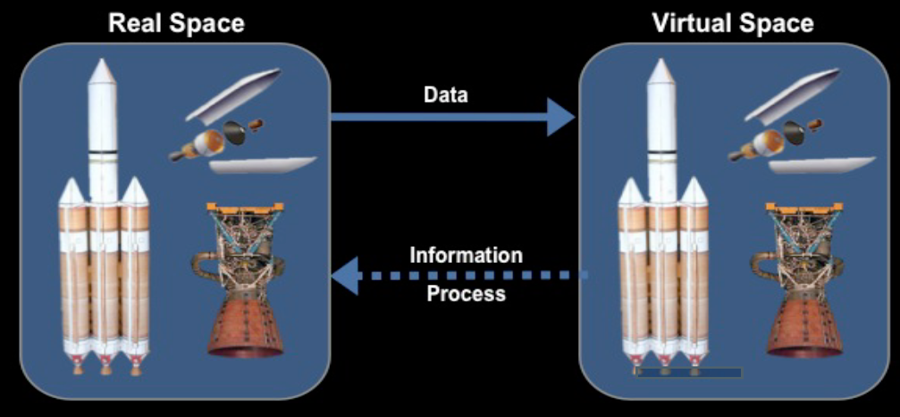

Today, Jooil Park, CEO of ANSYS Korea, one of the biggest companies offering multiphysics simulation products for various applications, visited the campus and talked about how the company's simulation technology benefit the current industries in various fields such as manufacturing, aerodynamics, and electronics, and the future of digital twin. Since our lab has been using the products of ANSYS as a part of our research, I was very excited to meet him and listen to his talk.

During his talk, I was able to realize that two important concepts that the company ANSYS is currently focusing on for the future. Those were 'digital twin' and 'AI' technologies. When I heard the concenpt of 'digital twin', I was confused about the difference between conventional simulation and digital twin. Dr. Michael Grieves introduced the concept of digital twin for the first time in 2003. In his definition, the most important characteristic of digital twin is the data flow connecting between the physical space and the virtual space. From this point of view, I guess the term 'digital twin' refers to a system that enables a continuous improvement and management of the physical system based on the simulation result from the virtual system. With a superior capability to simulate various physical problems, ANSYS is currently trying to build a digital twin that allows us to manage a very complex facility such as a data center.

Also, as a thermal engineer, I'm very thrilled about how AI technology can accerlerate the tedious and time-consuming process to obtain an accurate solution for thermal-fludic problems by a new simulation technology that ANSYS is currently working on. Maybe we can think of a huge deep learning model trained by data from a variety of physical problems. This model might well simulate the outcome of the physical situations involving heat and mass transfer without rigorously solving the complex equations. 

