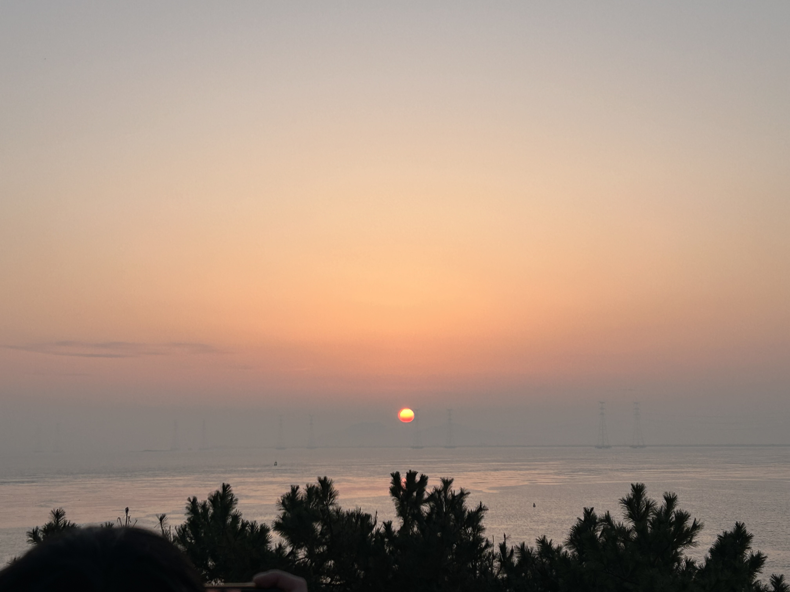
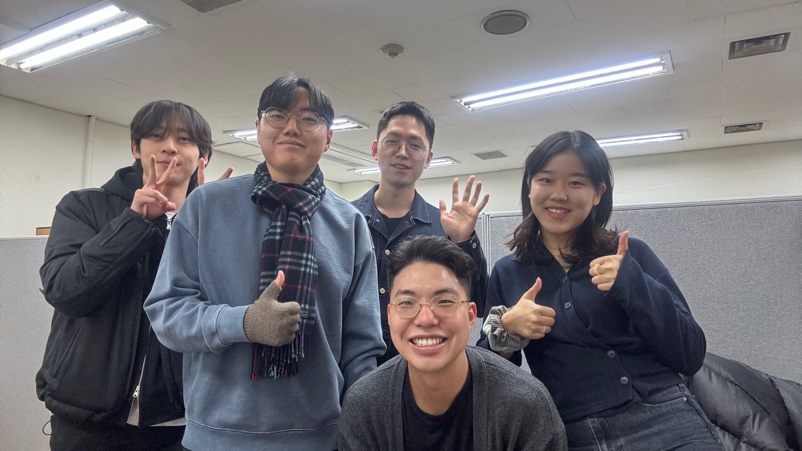

## New year

It is a new year. My family often goes to see the first sunrise of the coming year, as a family tradition. In this year, we visited the west coast to see the sunrise on January 1st. Although the weather forecast predicted clouds, we were fortunate enough to witness the sun peaking out of the clouds, and we made some wishes for 2024. I wished that I would win the lotto this year. (Just kidding!)

After I decided to postpone my admission to graduate schools for Ph. D. programs last year, I thought that it would be better to record or write down experiences and thoughts every month to look back and see if I'm on the right track. This is the first post for that purpose. One day, some students who look forward to the similar career path with me might visit my website and see through what I wrote down. I hope that they can get some inspirations or lessons from my experience.

Although my fianl defense for the master's degree ended in December last year, I was really hectic in January. First of all, I had to prepare for my graduation. It included tedious paper works. (e.g. checking whether I return borrowed library books, reporting whether I dispose of some chemicals no longer needed) More importantly, I had to finish my thesis and submit it to the department. I know, many people think that a thesis for a master's degree is nothing important. But I believe that the thesis summarizes what I have done during the past two years and proves my efforts for the degree, which is why I put so much efforts into writing the thesis. Anyway, I was able to finish it till the deadline. (I plan to upload it on this website so that it is accesible to everyone.)

## The first journal paper

After finishing my master's thesis, I continued to work on writing my first journal paper. In fact, I thought I could have published the first journal paper by last winter, but it was really hard to keep working on preparing for the defence and writing the journal paper at the same time. From my schedule, it's been delayed quite a bit, so I've really concentrated on writing a journal paper in January to get it done as soon as possible. Personally, I think I'm quite good at writing reports or essays, but writing a journal paper was more difficult than I expected. I had to discuss a lot with my colleague and professor and answer their questions. For example, I had to check whether there were some jumps between the logics or some error in the assumptions; I had to have a clear answer for the contribution of my work; I had to explain the concept of my research so that everyone could easily understand it. One important thing I learnt while writing the first journal article is that I should be able to summarise and explain the key ideas in one or two sentences. Simplification is the most important thing and the hardest thing to do while writing the paper. After all these efforts, I finally submitted my first journal paper to the *international communications in heat and mass transfer* (IF=7.0, JCR top 4.7%). It was very exciting and I learned a lot. When I start the next journal paper, I think I will be better at planning my research and writing a paper. Of course, there are still a lot of steps to go before my paper is published, as I still have to go through some peer review stages. I hope to be able to complete all the processes by March.

Two people left our lab in January. One is my colleague who started the master's degree program with me, and she is going to work at Samsung. The other person is my senior, and he will continue his research in the national research institute. I hope they will do well in their new jobs. In February, I will have a graduation ceremony and it would be the last month for my Master's programme. I think I will spend most of the time to arrange the research topic for the next journal paper and prepare SOP or CV for admission. If the time allows me, I think I will take the TOEFL exam again to get a higher score in the speaking section, which was the weakest part in the last exam.

